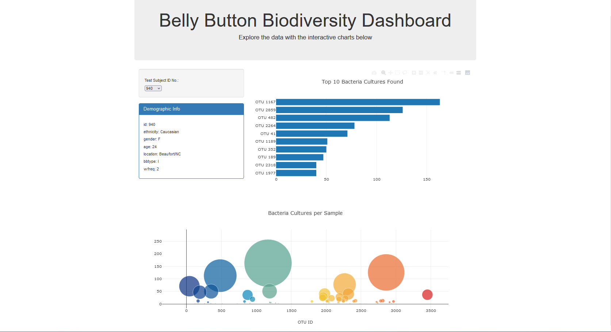

# web-visualization
Shows bellybutton bacteria diversity through charts using Plot.ly, with json data read in using d3.

## Web Page
The page shows data of bellybutton bacteria present in a patient.
  

  
Information displayed include a sample's top 10 bacteria cultures, total bacteria cultures, and it's patient demographics.
Users can view different patient samples as well, through choosing another option from the dropdown menu under 'Test Subject ID No.:'